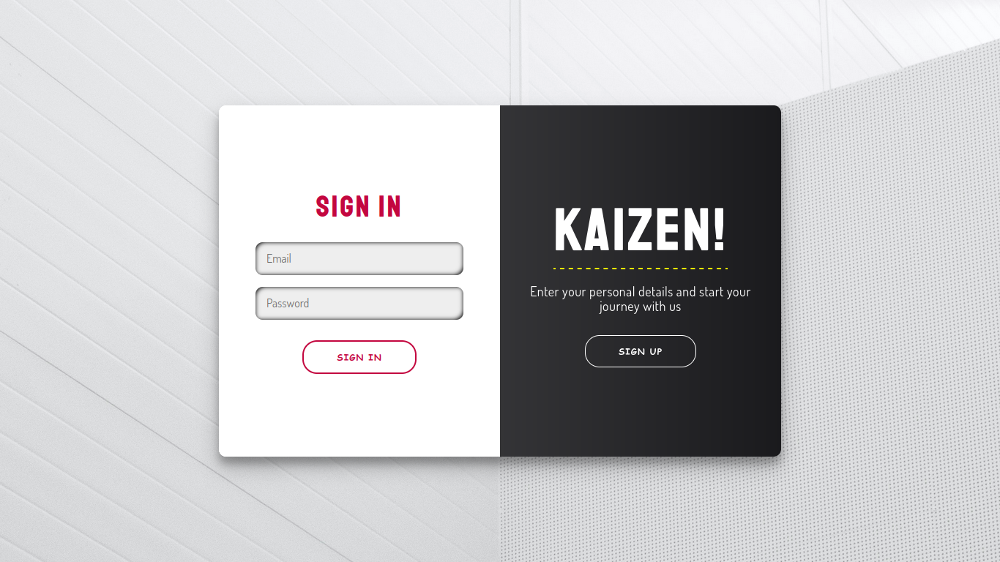
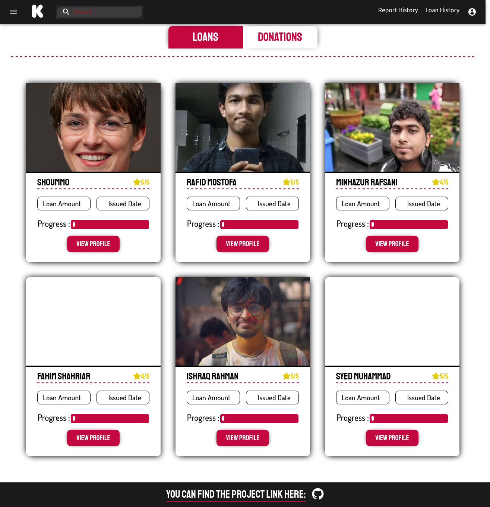
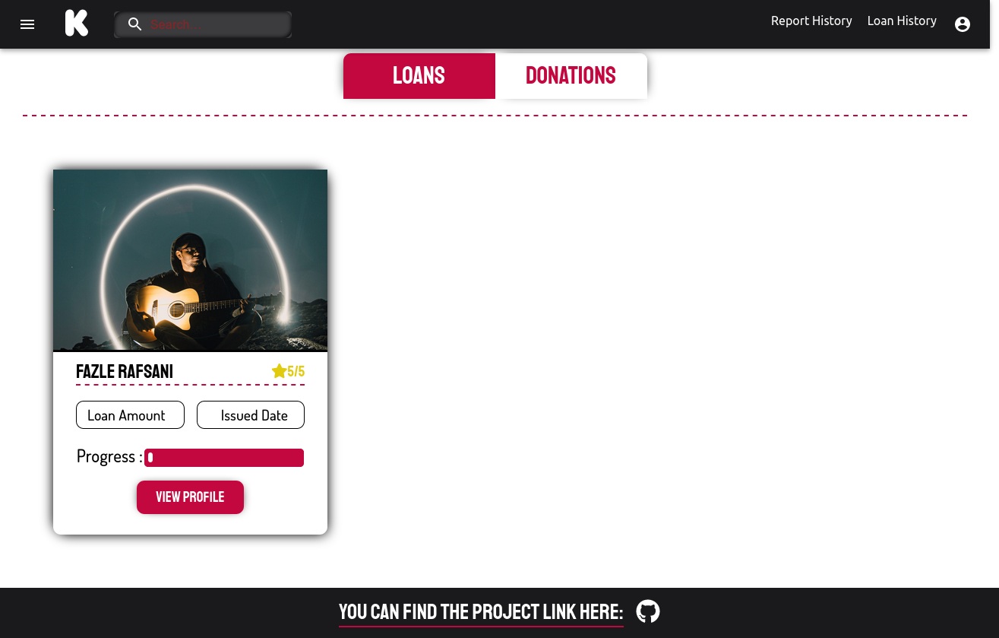
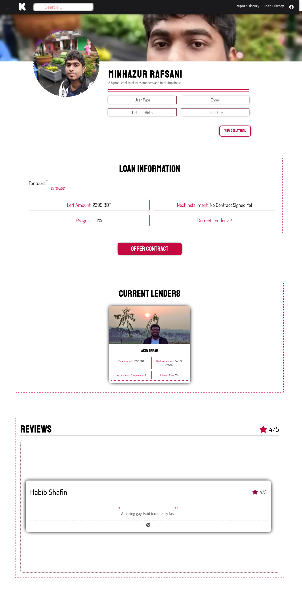
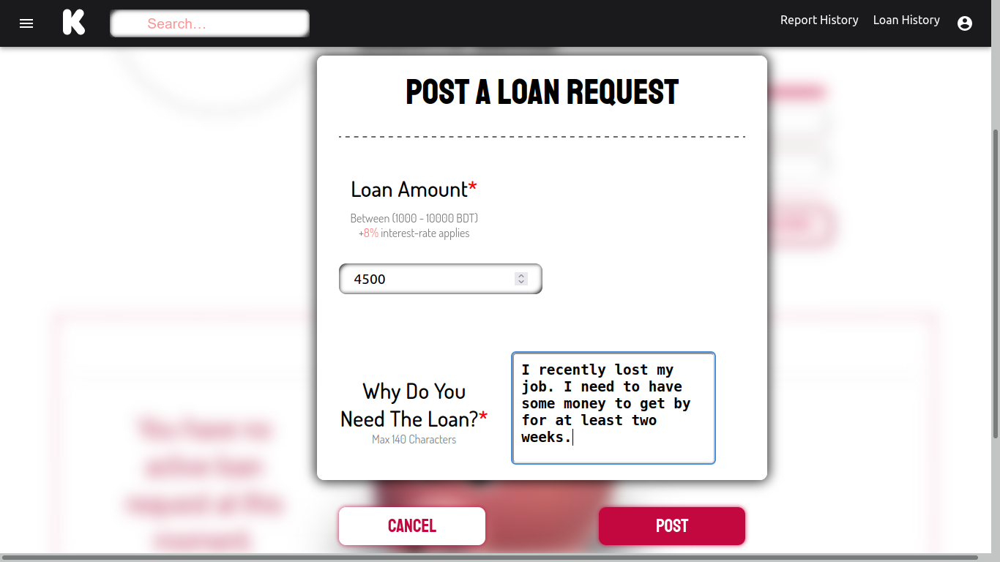
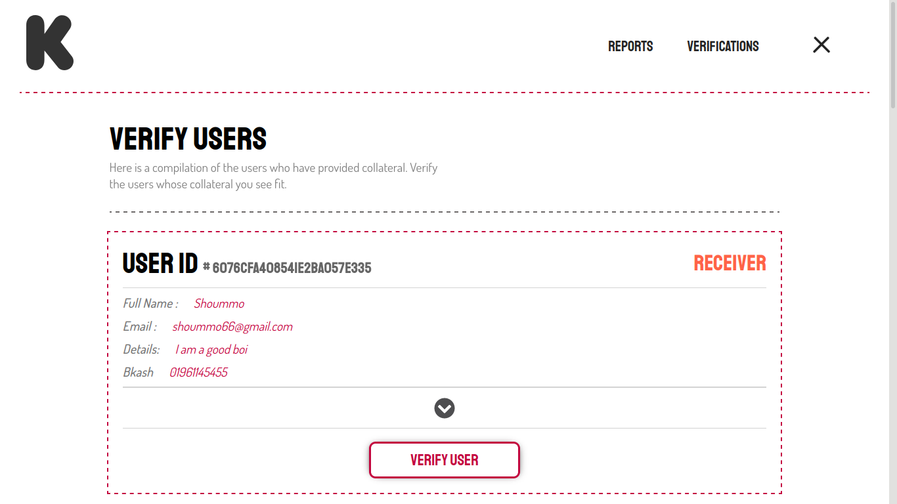
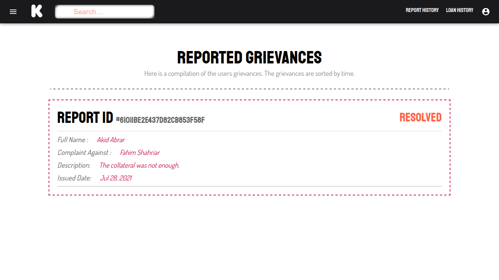

# KAIZEN
_A P2P Money Lending Platform_

### Description
* Users can lend, donate and borrow money from other users, through signing a contract.
* Loan receivers are required to show a collateral of equivalent worth which satisfies the lender.
* Admins verify user info and there is a limit on the loan amount to avoid/reduce fraud.

### Languages/Technologies
* MongoDB
* ReactJS
* NodeJS (Express)

### Run
You need to start the server first. In the [server](./server/) directory, execute the following commands:
```
$ npm i
$ npm start
```

Then, to spawn clients, go to the [client](./client/) directory and execute the following commands:
```
$ npm i
$ npm start
```

### Screenshots

Some screenshots of the project from different types of users are available in the [screenshots](./screenshots/) directory.

#### The login screen:


#### Lender dashboards:



#### Loan Receiver Profile (view from a Lender's account):


#### Loan Request (view from Receiver's account):


#### User Verification (view from Admin account):


#### Reported Complaints/Grievances (view from user account):


### Admin account
If the database is up and running, use the following credentials to login as an admin:
```
username: admin@gmail.com
password: admin
```

### Authors
This project was co-authored by [Ishraq R Rahman](https://github.com/Ishraq-R-Rahman), [Rafid Bin Mostofa](https://github.com/rebornplusplus) and [Fazle Rafsani](https://github.com/Rafsani).
